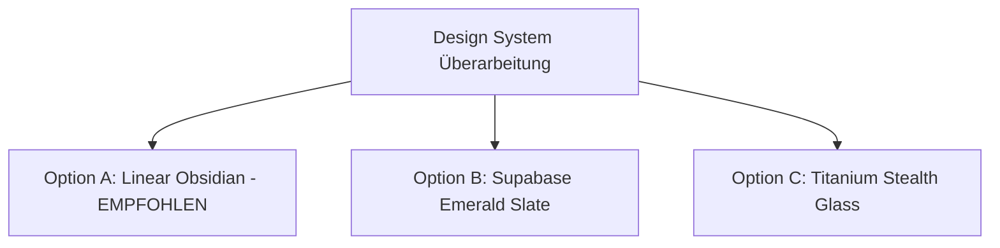

# Konzept: Unified Premium Design System & Theme Engine

Das Ziel dieser Überarbeitung ist es, die **Rebelein LagerApp** visuell auf das Niveau führender Premium-SaaS-Anwendungen (wie **Linear**, **Vercel**, **Supabase** oder **Raycast**) zu heben – völlig aus einem Guss, hochprofessionell und edel.

---

## 🧐 Warum wirkt die App aktuell noch nicht "wie aus einem Guss"?

Beim Audit des bestehenden Codes fallen drei Hauptgründe auf:

1. **Gemischte Farbwelten & Hartcodierte Werte**:
   * Einige Komponenten nutzen HSL-Variablen (`hsl(var(--card))`), andere Tailwind-Farben (`bg-zinc-950`, `bg-slate-900`) und wieder andere feste Hex-Codes (`bg-[#18181b]`, `bg-[#0a0f0d]`).
2. **Inkonsistente Abrundungen & Schatten**:
   * Knöpfe und Karten nutzen durcheinander `rounded-lg`, `rounded-xl`, `rounded-2xl` und `rounded-3xl`.
3. **Fehlendes zentrales Design-Token-System**:
   * Rahmengrenzen (`border-white/5`, `border-emerald-500/20`, `border-border/60`) variieren von Modul zu Modul.

---

## 💎 3 Vorschläge für ein durchgängiges Premium-Theme Paket

### Option A: **Linear Obsidian (Empfohlen - Der Goldstandard)**
* **Stil**: Inspiriert von *Linear.app* und *Raycast*. Extrem edel, modern und gestochen scharf.
* **Farben**:
  * **Hintergrund**: Tiefschwarzer Obsidian-Ton (`#09090b` / Zinc-950)
  * **Karten & Panels**: Dezent abgehobenes dunkles Zinc (`#18181b` / Zinc-900) mit extrem feiner 1px Randlinie (`#27272a` / Zinc-800)
  * **Akzent**: Präzises Smaragdgrün (`#10b981`) & Subtile Mikro-Glow-Effekte
* **Wirkung**: Wirkt wie ein hochpreisiges Profi-Werkzeug, auf allen Geräten gestochen scharf und 100% konsistent.

### Option B: **Supabase Emerald Slate**
* **Stil**: Inspiriert von *Supabase* und *Vercel*.
* **Farben**:
  * **Hintergrund**: Dunkles Mitternachts-Schiefergrau (`#020617` / Slate-950)
  * **Karten**: Transparente Schiefer-Panels (`bg-slate-900/60`) mit smaragdgrünen Akzentstreifen
* **Wirkung**: Technisch, modern, sehr gut lesbar auf Tablets.

### Option C: **Titanium Stealth Glass**
* **Stil**: High-End Glasmorphismus mit OLED-Schwarztönen.
* **Farben**:
  * **Hintergrund**: Reine OLED-Dunkelheit (`#000000`)
  * **Karten**: Frosted Glass Effekte mit metallischen 1px Verläufen
* **Wirkung**: Futuristische High-End Optik.

---

## 🛠️ Wie stellen wir sicher, dass das Design "aus einem Guss" ist?

Wir bauen das globale Stylesheet [`index.css`](file:///home/goe/Lager/index.css) und die Basiskomponenten ([`UIComponents.tsx`](file:///home/goe/Lager/src/components/UIComponents.tsx)) nach folgenden 4 Prinzipien um:

1. **Einheitliche Token für Radien & Abstände**:
   * Alle Karten: `rounded-xl`
   * Alle Buttons & Inputs: `rounded-lg`
   * Alle Badges: `rounded-md`
2. **Standardisierte Randlinien & Schatten**:
   * Keine 10 verschiedenen Randfarben mehr – alle Komponenten nutzen einheitliche `border-border/60` mit subtilem Hover-Glow.
3. **Perfekte Light- & Dark-Mode Harmonie**:
   * Vollständige Umstellung auf semantische Variablen – Schalten auf Hellmodus funktioniert in 100% der App fehlerfrei.
4. **Professionelles Theme-Auswahlmenü**:
   * Das Aussehen kann direkt in den Einstellungen umgeschaltet werden.
