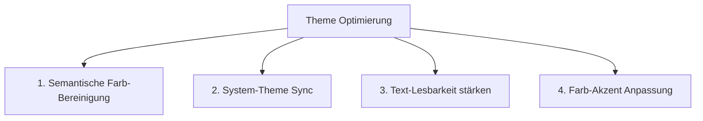

# Theme & Design System Analyse (Rebelein LagerApp)

Dieses Dokument bietet eine tiefe Analyse des **Theme- & Design-Systems** der LagerApp hinsichtlich Farbpalette, Kontrasten, Typografie, Dunkel-/Hellmodus und visueller Konsistenz.

---

## 🎨 1. Theme-Architektur & Farbsystem

Die Anwendung nutzt Tailwind CSS v4 mit semantischen CSS-Variablen auf HSL-Basis.

### Farb-Tokens & Modul-Farbcodierung

| Status / Modul | Primäre Farbe | CSS-Klassen (Beispiel) | Zweck / Bedeutung |
| :--- | :--- | :--- | :--- |
| **Hauptakzent** | Emerald / Smaragd | `bg-primary` / `text-emerald-400` | Markenfarbe, primäre Buttons, "Bereitgestellt", "Verfügbar" |
| **In Vorbereitung / Ausleihe** | Kobaltblau | `bg-blue-500/20` / `text-blue-400` | Kommissionen in Vorbereitung, ausgeliehene Maschinen |
| **Retouren & Lieferanten** | Violett / Purpur | `bg-purple-500/20` / `text-purple-400` | Rückgaben, Lieferanten-Zuordnung, SKUs |
| **Warnungen & Notizen** | Amber / Bernstein | `bg-amber-500/20` / `text-amber-300` | Überfällige Termine, Lager-Notizen, niedrige Bestände |
| **Fehler, Rückstände & Trash** | Rose / Rot | `bg-rose-500/20` / `text-rose-400` | Rückstandsmeldungen, Storno, gelöschte Elemente |

---

## 🔍 2. Detaillierte Theme-Analyse & Befunde

### 1. Dualer Farbmodus (Dark / Light Mode)
* **Dunkelmodus (`dark`)**:
  * Sehr gut abgestimmter Kontrast (`background`: `hsl(222.2 84% 4.9%)`, `foreground`: `hsl(210 40% 98%)`).
  * Ermüdungsfrei für Werkstatt- und Lagerumgebungen.
* **Hellmodus (`light`)**:
  * **Schwachstelle**: An einigen Stellen sind feste dunkle Farbwerte hartcodiert (z. B. `bg-[#18181b]`, `bg-[#0a0f0d]`, `bg-black/45`), wodurch beim Umschalten auf das helle Theme manche Modale oder Dropdowns dunkel bleiben.

### 2. Glasmorphismus (`glass` vs `default`)
* **Stärken**: Elegantes, modernes Erscheinungsbild durch subtile Weichzeichnung (`backdrop-blur-md`) und feine Ränder (`border-white/10`).
* **Performance-Schutz**: Der eingebaute *Low-Performance Modus* deaktiviert Grafikfilter auf leistungsschwächeren Geräten korrekt.

### 3. Typografie & Lesbarkeit
* **Hauptschriftart**: **Inter** (saubere geometrische Sans-Serif, ideal für hohe Informationsdichte).
* **Monospace**: Wird konsequent für SKUs, EANs und Auftragsnummern eingesetzt.
* **Gradient-Texte**: Manche Überschriften nutzen Text-Gradients (`bg-clip-text text-transparent`). Auf kleineren Schriftgrößen senkt dies die Schärfe. Plain Solid Text ist auf mobilen Geräten besser lesbar.

---

## 🛠️ 3. Konkrete Optimierungsvorschläge für das Theme

1. **Hartcodierte Farben durch semantische Variablen ersetzen**:
   * Statt `bg-[#18181b]` überall `bg-popover` oder `bg-card` nutzen, damit der Light-Mode perfekt funktioniert.
2. **Auto-System Theme Sync (`prefers-color-scheme`)**:
   * Möglichkeit bieten, dass sich das Theme automatisch der Systemeinstellung des Tablets / Desktops anpasst.
3. **Schärfere Text-Farben statt kleiner Gradients**:
   * Überschriften in Listen und Kacheln in klarem, durchgehendem Kontrast halten (`text-foreground`).
4. **Erweiterbare Farb-Akzente im ThemeSelector**:
   * Option bieten, die Akzentfarbe individuell zu wählen (Smaragdgrün, Saphirblau, Schiefergrau).
